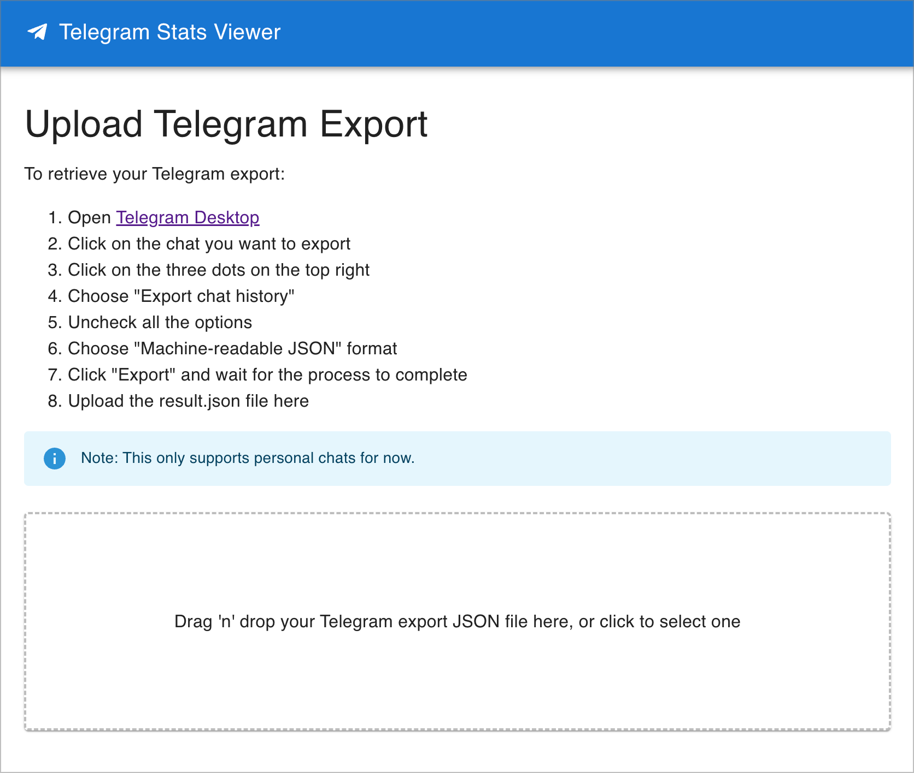
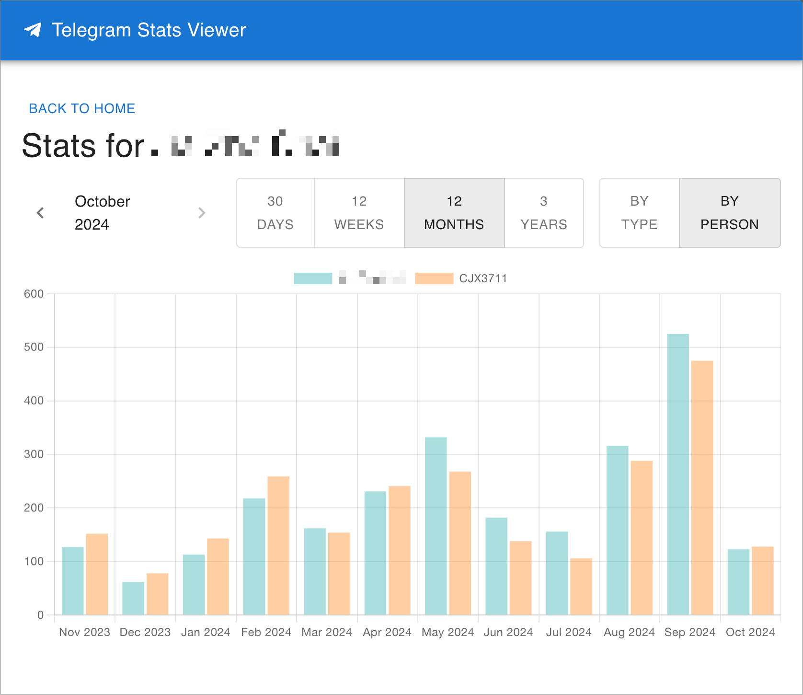
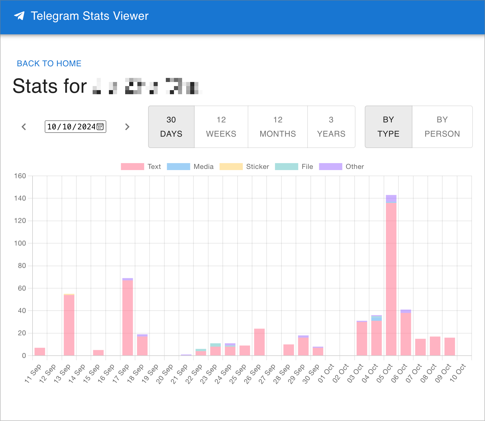

# Telegram Stats Viewer

Telegram Stats Viewer is a web application that allows users to analyze and visualize their personal Telegram chat statistics. This tool processes Telegram chat export files locally in the browser, providing insights into message trends, chat duration, and more.

## Features

- Upload and process Telegram chat export files (JSON format)
- Visualize message statistics with interactive charts
- Analyze message trends over time (daily, weekly, monthly, yearly)
- Compare message types (text, media, stickers, files)
- View statistics by person or message type
- Secure local processing (no data transmitted or stored externally)

## Screenshots







## Getting Started

### Prerequisites

- Node.js (version 18 or higher recommended)
- yarn

### Installation

1. Clone the repository:

   ```
   git clone https://github.com/cjx3711/telegram-stats.git
   cd telegram-stats
   ```

2. Install dependencies:

   ```
   yarn
   ```

3. Start the development server:

   ```
   yarn dev
   ```

4. Open your browser and navigate to `http://localhost:2013`

## Usage

1. Export your Telegram chat history:

   - Open Telegram Desktop
   - Select the chat you want to analyze
   - Click on the three dots menu and choose "Export chat history"
   - Uncheck all options and select "Machine-readable JSON" format
   - Click "Export" and wait for the process to complete

2. Upload the exported JSON file to the Telegram Stats Viewer

3. Explore your chat statistics using the interactive charts and filters

## Technologies Used

- React
- TypeScript
- Vite
- Chart.js
- Material-UI
- date-fns

## Deployment

Create a `.env` file with the following:

```
REMOTE_DIR=<user>@<host>:/<path>/
```

Then run `yarn build:push` to build and deploy the project.

Move the `serve.sh` file to the same folder and run it to serve the site using pm2.

### Requirements:

- Linux-based system (tested on Ubuntu 20)
- Node.js 18+
- pm2 (will be installed if it's not already)
- serve (will be installed if it's not already)

## Contributing

If you want to contribute that'll be great! But I have no plans to maintain this project.

## License

This project is licensed under the Creative Commons Attribution-NonCommercial 4.0 International License - see the [LICENSE](LICENSE) file for details.

[](https://creativecommons.org/licenses/by-nc/4.0/)

## Acknowledgements

- Created by [CJX3711](https://github.com/cjx3711)
- Inspired by my friend needing a simple way to analyse the messages from the various people they've been dating.
